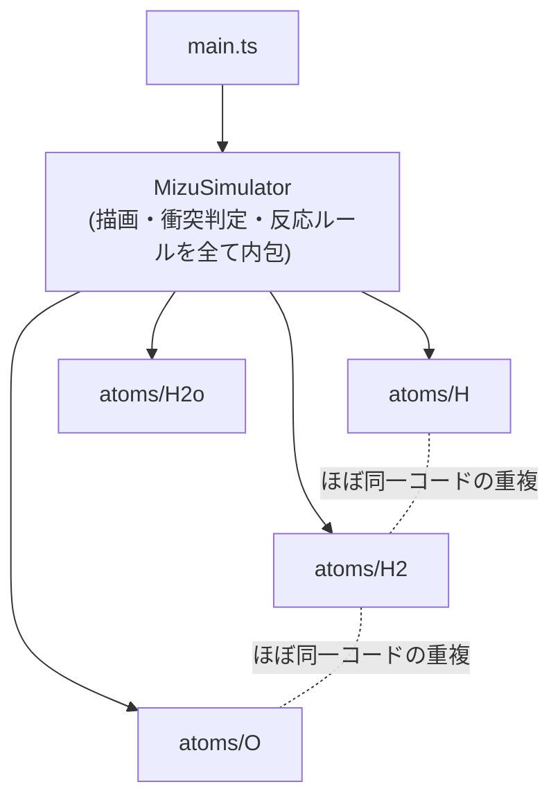
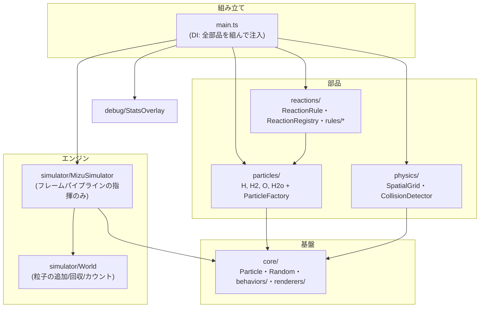
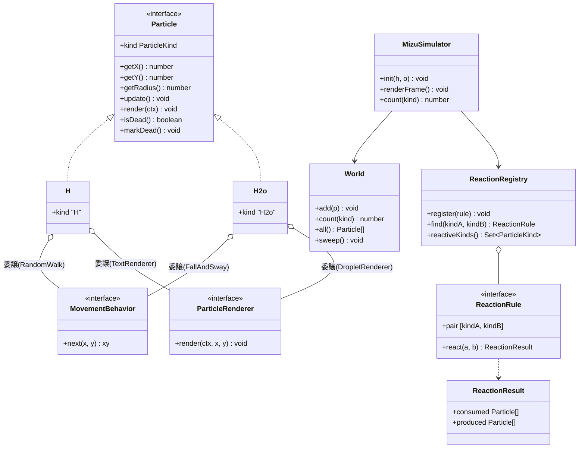
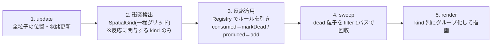
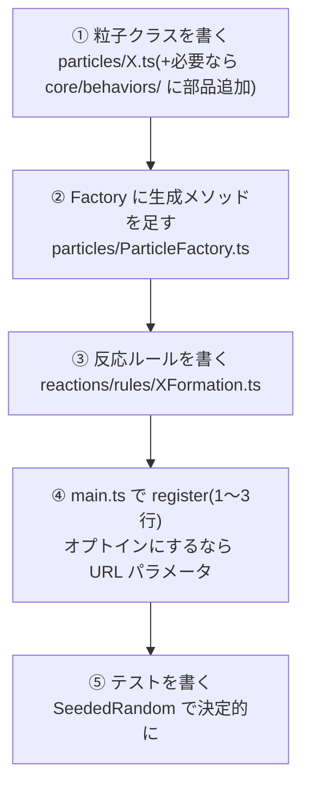

# Mizu-ts アーキテクチャドキュメント

2026-07 の再設計(feature/redesign、Phase 0〜4)で何をどう変えたかの記録と、**新しい分子・反応を追加するための拡張ガイド**。

- 経緯の詳細な計画とレビュー記録: [redesign-plan.md](./redesign-plan.md)
- 再設計の動機となった分析: [redesign.md](./redesign.md)

---

## 1. 旧アーキテクチャ(〜 `dd38938`)



### 何が問題だったか

| # | 問題 | 影響 | 再設計での解決 |
|---|---|---|---|
| P1 | H / H2 / O がコピペ実装(移動・当たり判定・色・スケールが3重複) | 修正が3箇所に波及する | 移動を `RandomWalk`、描画を renderer に集約し、粒子は部品を**合成**する薄いクラスに(§2.3) |
| P2 | 反応ルール(H+H→H2、O+H2→H2o)が MizuSimulator にハードコード | 新分子の追加にシミュレータ本体の改修が必須 | `ReactionRule` + `ReactionRegistry` に分離。追加はルール登録だけ(§3) |
| P3 | `render()` の中で位置更新も行う(更新と描画が密結合) | 「1フレーム進める」テストに描画コンテキストが必要 | `update()` / `render()` を分離したパイプライン(§2.4) |
| P4 | 衝突判定が総当たり O(n²) + ループ中の `indexOf`/`splice` | 粒子数を増やすと急激に劣化(実測: h=500 で約 9fps) | `SpatialGrid`(一様グリッド、平均 O(N))+ mark-and-sweep(§2.4、§2.5) |
| P5 | 粒子1体の生成ごとに `document.createElement('canvas')` + `measureText` | 反応のたびに canvas 生成が走る | measureText 結果を static Map にキャッシュ(初回のみ計測) |
| P6 | 毎フレーム全粒子に shadowBlur 付き `fillText` | 描画コストが高い | スプライト化を試行したが実測で退行し**不採用**(§2.6)。kind 別グループ描画のみ採用 |
| P7 | `Math.random()` 直呼びで挙動が非決定的 | テストが「動いたこと」しか検証できない | `Random` インターフェース注入。テストは `SeededRandom`(§2.1 原則4) |
| P8 | `H2.isHit()` が常に false のデッドコード | — | 削除 |
| P9 | 配列 splice による添字ずれリスク | 壊れやすい | `World.sweep()`(filter 1パス)に統一 |

---

## 2. 新アーキテクチャ

### 2.1 設計原則(4つ)

1. **インターフェースと会話する** — エンジン(`MizuSimulator` / `World` / 衝突検出)は具象粒子クラス(H, O, …)を知らない。`Particle` インターフェースと反応ルールの登録だけで動く。
2. **継承より委譲** — 粒子の共通部分は「共通親を継承」ではなく「共通部品(behavior / renderer)を合成」で解消する。abstract class はゼロ。
3. **更新と描画の分離** — 1フレーム = `update → 衝突検出 → 反応適用 → 死亡回収 → render` のパイプライン。`render()` は状態を変更しない。
4. **決定可能性** — 乱数は `Random` インターフェースとして注入。テストでは `SeededRandom` に差し替えて「期待した位置になったこと」まで検証する。

### 2.2 レイヤ構成と依存方向



依存は常に下向き(→ core)の一方向。循環依存ゼロは CI の `npm run depcruise` で担保している。

### 2.3 中核インターフェース



ポイント:

- **粒子クラスは「薄い」**: 座標と dead フラグを持ち、移動は behavior に、描画は renderer に委譲するだけ。H と O の違いは合成する部品(と kind)だけ。
- **反応は宣言的**: ルールは `{consumed: 消える粒子, produced: 生まれる粒子}` を返すだけ。**個数収支はルールが全権を持つ**(エンジンは消して足すだけ)。
- **生成後の一生も粒子クラスが持つ**: H2o は「落下して画面下端で `markDead()`」という自分のライフサイクルを `update()` の中に持つ。エンジンは `isDead()` を見て回収するだけ。

### 2.4 フレームパイプライン



- **2**: `ReactionRegistry.reactiveKinds()`(登録ルールの pair に現れる kind の集合)でフィルタしてから衝突検出に渡す。どのルールにも現れない kind(H2o など)は大量に滞留するため、渡すとグリッド走査が支配的になる(Phase 2 で実測 1.6 倍の退行 → この仕組みで解消)。
- **3**: 同一フレームで同じ粒子が2回反応しないよう、ペア処理前に `isDead()` をチェック。
- **5**: kind ごとにまとめて描画する。旧実装の kind 単位の重なり順(H→H2→O→H2o)の再現。

### 2.5 性能(実測)

計測: Chrome / macOS、1280×800、rAF タイムスタンプ差分。旧コードとの比較は**同日に worktree で並行起動した A/B**(日をまたぐと環境差が大きく比較にならない)。

| シナリオ | 旧コード | 再設計後 | 備考 |
|---|---|---|---|
| デフォルト(h=30, o=50) | 60fps | 60fps | 劣化なし(renderFrame 1.8ms → 1.3ms) |
| h=500, o=500 | 251ms/frame(~4fps) | **81ms/frame(~12fps)** | 約 3.1 倍 |
| h=1000, o=1000 | 計測不能(応答なし) | 412ms/frame | 旧は DevTools も応答不能 |

h=1000 で 60fps という当初目標は**未達**。ボトルネックは衝突判定ではなく、仕様上どんどん滞留する H2o(数万個)のグラデーション描画そのもの。これ以上は WebGL 化(インスタンス描画)か H2o 数の上限(=世界観の変更)が必要で、本再設計のスコープ外とした。

### 2.6 やってみて不採用にしたこと(重要な教訓)

**スプライトキャッシュ(P6 対策)は実装 → 実測 → 不採用**。粒子の見た目をオフスクリーン canvas に焼き込んで `drawImage` する方式は、JS 時間は短縮する(69ms → 57ms)ものの、**canvas ソースの `drawImage` と大量のグラデーション fill が同一フレームに共存すると、フレーム全体のラスタライズが遅いパスに落ち**、実フレーム時間が 82ms → 150〜200ms に退行した。描画順のグループ化・スプライト寸法の統一・生成頻度の削減のいずれでも解消せず。

> **再挑戦する人へ**: jsdom や `getImageData` を挟むマイクロベンチはラスタライズ経路が異なり「スプライトの方が速い」という逆の結論が出る。判断は必ず実ページの rAF タイムスタンプ計測(A/B)で行うこと。

採用したのは: measureText の static キャッシュ(P5)、kind 別グループ描画、H2o の `shadowBlur=1` 明示化(旧実装は他粒子が canvas に残した影設定への暗黙依存で動いていた)。

---

## 3. 拡張ガイド — 新しい分子・反応の追加方法

**エンジン(simulator/ physics/ core/ の既存ファイル)には一切触らない**のが原則。触る必要が出たらアーキテクチャの欠陥なので、このドキュメントの懸念点(§4)と照らして相談すること。

追加は次の3点セットで完結する:



以下、実際に動作確認済みの「オゾン生成チェーン」(O + O → O2、O2 + O → O3、O3 は蒸発して消える)を例に全コードを示す。

### ① 粒子クラス(particles/O2.ts)

behavior + renderer を合成するだけの薄いクラス。H2 とほぼ同型。

```ts
import type { Particle, ParticleKind } from '../core/Particle';
import type { MovementBehavior } from '../core/behaviors/MovementBehavior';
import type { ParticleRenderer } from '../core/renderers/ParticleRenderer';

export class O2 implements Particle {
  public readonly kind: ParticleKind = 'O2';
  private dead = false;

  constructor(
    private x: number,
    private y: number,
    private readonly r: number,
    private readonly movement: MovementBehavior,
    private readonly renderer: ParticleRenderer,
  ) {}

  public getX(): number { return this.x; }
  public getY(): number { return this.y; }
  public getRadius(): number { return this.r; }

  public update(): void {
    const next = this.movement.next(this.x, this.y);
    this.x = next.x;
    this.y = next.y;
  }

  public render(ctx: CanvasRenderingContext2D): void {
    this.renderer.render(ctx, this.x, this.y);
  }

  public isDead(): boolean { return this.dead; }
  public markDead(): void { this.dead = true; }
}
```

### ②「生成後の一生」を持たせる場合(O3 の蒸発の例)

「結合した後の振る舞い」は produced される粒子クラス自身が定義する。O3 は「ゆっくり上昇しながら約4〜6秒でフェードして消える」を持つ。

まず movement 部品(core/behaviors/RiseAndSway.ts — 部品の**追加**は core/ でも OK):

```ts
import type { Random } from '../Random';
import type { MovementBehavior } from './MovementBehavior';

/** 揺れながらゆっくり上昇する(FallAndSway の上昇版・速度半分) */
export class RiseAndSway implements MovementBehavior {
  constructor(
    private readonly size: number,
    private readonly random: Random,
  ) {}

  public next(x: number, y: number): { x: number; y: number } {
    const dx = this.random.next() * 5;
    return {
      x: x + Math.cos((y + dx) / 100),
      y: y - this.size * 0.05,
    };
  }
}
```

粒子側(particles/O3.ts)。寿命・フェード・死亡は `update()` に、透明度の適用は `render()` に:

```ts
export class O3 implements Particle {
  public readonly kind: ParticleKind = 'O3';
  private dead = false;
  private elapsedFrames = 0;
  private opacity = 1;

  constructor(
    private x: number,
    private y: number,
    private readonly r: number,
    private readonly movement: MovementBehavior,
    private readonly renderer: ParticleRenderer,
    private readonly lifespanFrames: number, // Factory 側で 240 + random.next() * 120
  ) {}

  public update(): void {
    const next = this.movement.next(this.x, this.y);
    this.x = next.x;
    this.y = next.y;

    this.elapsedFrames++;
    this.opacity = Math.max(0, 1 - this.elapsedFrames / this.lifespanFrames);
    if (this.elapsedFrames >= this.lifespanFrames) {
      this.markDead(); // World.sweep() が次のフレーム境界で回収する
    }
  }

  public render(ctx: CanvasRenderingContext2D): void {
    const prev = ctx.globalAlpha;
    ctx.globalAlpha = prev * this.opacity; // ParticleRenderer は無変更でフェードできる
    this.renderer.render(ctx, this.x, this.y);
    ctx.globalAlpha = prev; // render は共有状態を汚さない
  }
  // getX/getY/getRadius/isDead/markDead は O2 と同様
}
```

### ③ Factory メソッド(particles/ParticleFactory.ts に追記)

```ts
public createO2(x: number, y: number): O2 {
  const size = this.measureTextWidth('O2'); // static キャッシュ済み。canvas 生成は初回のみ
  return new O2(
    x, y, size / 2,
    new RandomWalk(this.sw, this.sh, size, this.random),
    new SubscriptTextRenderer('O', '2', this.randomColor(), this.baseFontSize(),
      18 * this.getScale(), size),
  );
}

public createO3(x: number, y: number): O3 {
  const size = this.measureTextWidth('O3');
  return new O3(
    x, y, size / 2,
    new RiseAndSway(size, this.random),
    new SubscriptTextRenderer('O', '3', this.randomColor(), this.baseFontSize(),
      18 * this.getScale(), size),
    240 + this.random.next() * 120, // 寿命: 約4〜6秒(個体差)
  );
}
```

### ④ 反応ルール — 個数収支はここで完全にコントロールする

ルールは `{consumed, produced}` を返すだけ。**何を消して何を生むかは配列の中身で自由に決められる**。代表的な3パターン:

```ts
/** パターンA: 片方を変換し、もう片方は再生成(O + O → O2。O -1, O2 +1) */
export class O2Formation implements ReactionRule {
  public readonly pair: [ParticleKind, ParticleKind] = ['O', 'O'];
  constructor(private readonly factory: ParticleFactory) {}

  public react(a: Particle, b: Particle): ReactionResult {
    return {
      consumed: [a, b],
      produced: [
        this.factory.createO2(b.getX(), b.getY()), // 衝突座標で O2 化
        this.factory.createOAtRandom(),            // もう片方は再生成
      ],
    };
  }
}

/** パターンB: 両方消して1つだけ生む(O2 + O → O3。O -1, O2 -1, O3 +1) */
export class OzoneFormation implements ReactionRule {
  public readonly pair: [ParticleKind, ParticleKind] = ['O2', 'O'];
  constructor(private readonly factory: ParticleFactory) {}

  public react(a: Particle, b: Particle): ReactionResult {
    // pair は (A,B) 両順でマッチするので、引数順に依存せず kind で判別する
    const o2 = a.kind === 'O2' ? a : b;
    return {
      consumed: [a, b],
      produced: [this.factory.createO3(o2.getX(), o2.getY())],
      // パターンC(収支を ±0 にしたい)なら、ここに
      // this.factory.createOAtRandom() を1行足すだけ
    };
  }
}
```

> **収支設計の注意**: ルールを書くときは kind ごとの収支表(+1/-1/±0)を必ずコメントに書くこと。例えば上の A+B 構成は O が正味減り続けるため、放置すると O が枯渇して既存の水の生成(O+H2)も止まる。これは実測済みの挙動(O 300 → 3)。閉じた循環にしたいかはルール作者の設計判断。

### ⑤ main.ts での登録

```ts
const isO3Enabled = urlParams.get('o3') === '1'; // オプトインにする場合

registry.register(new HHFusion(factory));
registry.register(new OxidationToWater(factory));
if (isO3Enabled) {
  registry.register(new O2Formation(factory));
  registry.register(new OzoneFormation(factory));
}
```

これだけで新 kind は衝突判定の対象に自動で入る(`reactiveKinds()` がルールの pair から導出するため)。`?m=1` オーバーレイに表示したい場合は main.ts の kind リストに追加する(§4 懸念点 3)。

### ⑥ テストの書き方

```ts
// ルール単体: 収支を決定的に検証
it('O2Formation は O -1, O2 +1', () => {
  const factory = new ParticleFactory(800, 600, new SeededRandom(42));
  const rule = new O2Formation(factory);
  const a = factory.createO(100, 100);
  const b = factory.createO(105, 105);
  const result = rule.react(a, b);
  expect(result.consumed).toEqual([a, b]);
  expect(result.produced.map((p) => p.kind).sort()).toEqual(['O', 'O2']);
});

// 統合: World の個数で検証(至近距離に配置して1フレーム)
it('O 同士の衝突で O2 が生まれる', () => {
  const { simulator, world, factory } = createSimulator(); // registry に O2Formation を登録
  world.add(factory.createO(100, 100));
  world.add(factory.createO(105, 105));
  simulator.renderFrame();
  expect(simulator.count('O2')).toBe(1);
});

// 未登録なら何も起きないことも必ず検証する(オプトインの保証)
```

チェック一式: `npm run lint` / `npx vitest run` / `npm run build` / `npm run depcruise`(`npm test` は watch モードなので CI 以外では `npx vitest run` を使う)。

---

## 4. 懸念点・既知の限界

現在の汎用性は「**2体の衝突で何かが生まれ、生まれたものが自分の一生を生きる**」という枠。枠内なら数ファイルで拡張できるが、以下は枠の外にある:

1. **死亡時に何かを生めない** — 「O3 が寿命で O2 に分解して戻る」のような表現は不可。反応は produced を返せるが、寿命死は `World.sweep()` が黙って回収するだけ。必要になったら `Particle` に `onDeath(): Particle[]`(既定は空)を足し、sweep が回収時に spawn を集めて World に追加する小さな拡張で対応できる。
2. **反応は2体ペア限定** — 単独粒子の自然崩壊(時間経過で別の粒子に変身)や3体反応はルールとして書けない。崩壊は 1 の死亡時スポーンがあれば「寿命死 + onDeath で変身先を生む」で代替可能。
3. **オーバーレイの kind リストが main.ts にハードコード** — 新分子を足すとき1行追記が必要。`World` に kind 列挙 API を足せば消せる小さな傷。
4. **粒子の最大半径に上限がある** — `SpatialGrid` のセルサイズは「最大半径 24px」を前提にした固定値(48px)。それより大きい粒子(巨大分子など)を追加すると衝突検出が漏れる。前提が崩れると canary テスト(`SpatialGrid.test.ts`)が落ちるので黙って壊れはしないが、その場合は `MAX_PARTICLE_RADIUS` の見直しが必要。
5. **収支ミスによる世界の崩壊はコンパイルでは防げない** — ルールの produced を書き間違えると粒子が無限増殖/枯渇する。個数収支のユニットテストを必ず書くこと(§3-⑥)。
6. **負荷シナリオの 60fps は未達成** — 支配項は滞留 H2o の描画(§2.5)。スプライトキャッシュは実測で逆効果(§2.6)。次の一手は WebGL 化だが、複雑さに見合うかは要検討。

---

## 5. 付録: この再設計で実際に行った拡張の記録

アーキテクチャ検証のために「オゾン生成チェーン」を実装し、以下を確認した(§3 のコードはその実物。main には含めていない):

- 新分子2種(O2, O3)+ルール2種+蒸発ライフサイクルの追加で、**エンジン(simulator/ physics/)への変更はゼロ**だった
- 差し戻しもゼロ(粒子・ルールの追加は haiku クラスのモデルでも一発で通る程度に機械的)
- 収支は意図どおり制御できた(O 枯渇も含めて予測どおりの挙動)
